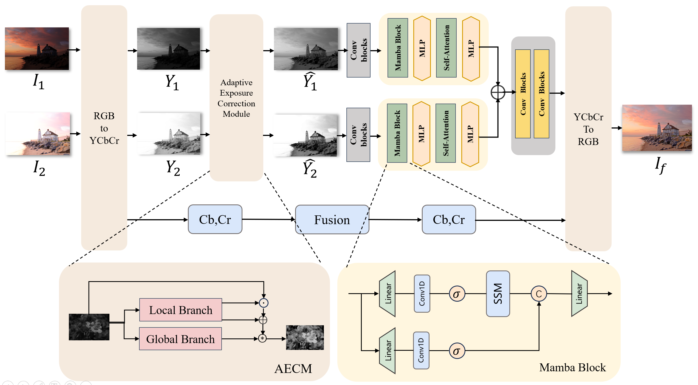
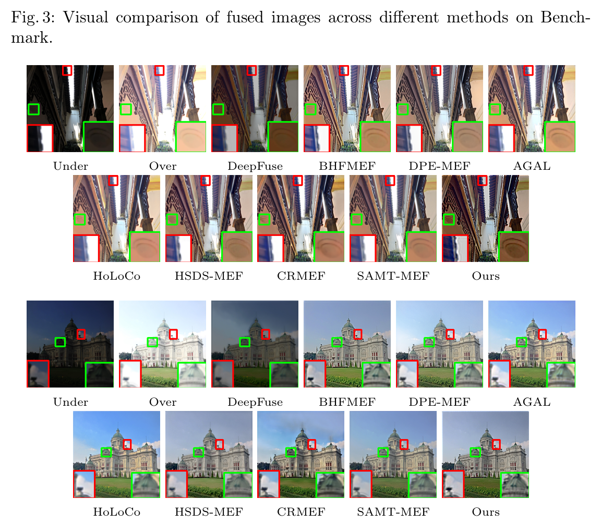
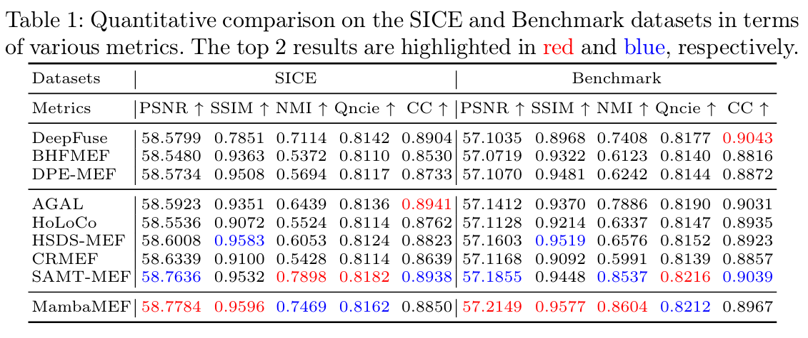
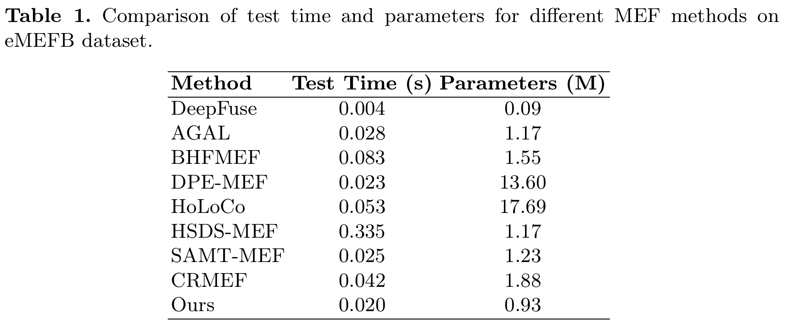

# MambaMEF

**MambaMEF: Adaptive Exposure Correction for Extreme Multi-Exposure Image Fusion**  
A lightweight, unsupervised MEF framework that combines the global modeling capabilities of Transformers with the computational efficiency of Mamba.

## 📖 Introduction

**MambaMEF** is a **lightweight, unsupervised framework** for extreme multi-exposure image fusion.  
It combines the **global modeling** capability of Transformer architectures with the **computational efficiency** of Mamba layers. 
This framework is designed to handle:

- Large exposure differences
- Complex lighting environments

The system is composed of two parts:
- **IAT module**: Performs adaptive exposure correction.
- **MambaMEF main network**: Conducts image fusion.

**Framework:**



**Visual Results:**

 

**Quantitative Results:**



**Speed and Parameters Analysis:**



Our method achieves an excellent balance between **inference speed**, **model size**, and **fusion quality**.
 While **DeepFuse** demonstrates small parameter size and high speed due to its use of only convolutional layers, it suffers from limited fusion performance. In contrast, our approach maintains competitive **test time** and **parameter count**, while delivering **superior image fusion results**, achieving an optimal trade-off between efficiency and effectiveness.

## ⚙ Requirements

- Python >= 3.8
- PyTorch >= 1.10
- CUDA >= 10.2 (recommended)
- Causal_conv1d
- Mamba_ssm

## 📂 Dataset Preparation

Dataset structure (each folder contains one under/over exposure pair):

```
DATASET_PATH/
    ├── scene1/
    │    ├── xxx_A.png   # Underexposed
    │    ├── xxx_B.png   # Overexposed
    ├── scene2/
         ├── ...
```

- `_A` means underexposed image
- `_B` means overexposed image

In `config.py` set your dataset paths:

```python
args.SERVER.TRAIN_DATA = "/path/to/train"
args.SERVER.VAL_DATA   = "/path/to/val"
args.SERVER.TEST_DATA  = "/path/to/test"
```

------

## 🚀 Training

```bash
python train.py --config 1
```

**Training workflow**:

- Data loading via `myUtils.build_dataset()`
- Core functions: `train_one_epoch` and `validate`
- Loss function: `fusion_loss_mef` (combines intensity, gradient, and SSIM terms)
- Checkpoints are saved under:

```
OUTPUT/checkpoints/
```

If you want to use the pretrained weights, you can find it in:

```
./ckp
```

------

## 🧪 Testing / Inference

```bash
python test.py --ckp checkpoint_xxxx.pth
```

**Inference steps**:

1. Load **MambaMEF** main model and **IAT** exposure correction model
2. Apply exposure correction to both underexposed and overexposed images
3. Fuse corrected luminance channels using MambaMEF
4. Merge chrominance channels and save fused RGB image to:

```
images/fused/MEFB/
```

**Output includes**:

- Model parameters and FLOPs
- Inference time (total and average per image)
- Example fusion results

------

## 📌 Citation

If you use this code in your research, please cite!
